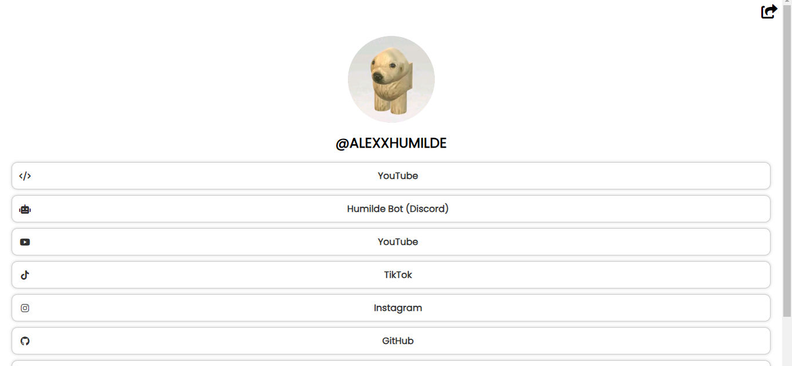
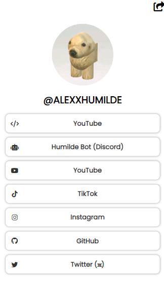

# Clone de Linktree hecho con HTML, CSS y JavaScript.

Hola, el dia de hoy te traigo un web de un clon de linktree, este es uno basico, donde van los enlaces de alguna, si te gustaria usarlo, te agradeceria darme creditos

¿Como usarlo?
* Para usarlo no necesitas instalar **nada de dependencias**, solo necesitas instalar la extensión de [Live server](https://marketplace.visualstudio.com/items?itemName=ritwickdey.LiveServer) o [Live Preview](https://marketplace.visualstudio.com/items?itemName=ms-vscode.live-server)

¿Como se ve la web en modo movil o PC?

* Modo PC

* Modo Movil

